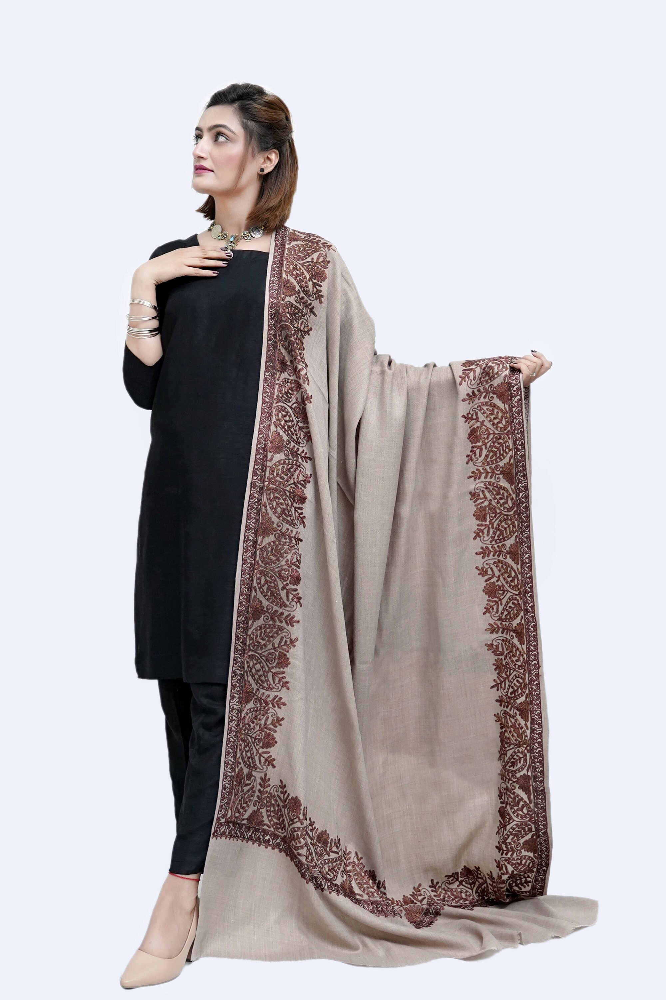

# 👗 Clothing Store Website

A modern and responsive **Clothing E-Commerce Website** built with **HTML, CSS, and JavaScript**.  
This project includes product categories, a hero slider, flash sale countdown, add-to-cart functionality, wishlist, and quick view modals.

---

## 🚀 Features
- **Header / Navigation**
  - Logo (clickable to homepage)
  - Shop, Categories, New Arrivals, Offers
  - Search bar with category filter & auto-suggestions
  - Wishlist & Cart (with item count + quick view)
  - Login button

- **Hero Section**
  - Image slider with autoplay
  - Call-to-Action buttons (Shop Now, Explore, Discover)

- **Categories**
  - Clickable category cards (Dresses, Jackets, Pants, Shoes, Tops)

- **Promotions**
  - Discount banner
  - Flash Sale with live countdown timer

- **Products**
  - New Arrivals, Best Sellers, Trending, Top Rated, Recently Viewed
  - Scrollable product carousels
  - Quick View modal with "Add to Cart" option

- **Cart & Wishlist**
  - Side cart with item count and total
  - Wishlist modal
  - Checkout button (demo)

- **Footer**
  - Quick links
  - Customer service info
  - Social links & trust badges

---

## 📂 Project Structure
```

Clothing-web/
│-- index.html
│-- style.css
│-- script.js
│-- images/
│-- README.md

````

---

## 🛠️ Technologies Used
- **HTML5**
- **CSS3** (Flexbox, Grid, Responsive Design)
- **JavaScript (ES6)**

---

## 📸 Screenshots
### 🏠 Homepage


### 🛍️ Categories


### 🛒 Cart
(Add screenshot of cart modal here)

---

## 🔧 Setup & Usage
1. Clone the repository:
   ```bash
   git clone https://github.com/Ume-e-Farwa/Clothing-web.git
````

2. Open the folder:

   ```bash
   cd Clothing-web
   ```
3. Open `index.html` in your browser.

---

## 📌 To-Do / Future Enhancements

* Add backend (Node.js / PHP / Firebase)
* User authentication
* Payment integration
* Database for storing products

---
## 🌐 Live Demo
👉 [View Website](https://resonant-kringle-028c0e.netlify.app)

